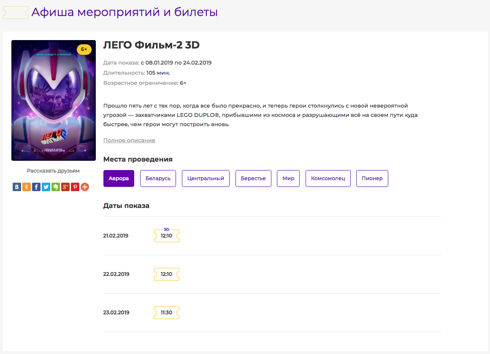

# Скрипт интеграции афиши 24guru.by

Скрипт позволяет интегрировать на ваш сайт афишу мероприятий **Республики Беларусь** с возможностью организации продажи билетов онлайн и **получении комиссионного вознагрождения**. 

Данное решение основано на технологиях компании [Arcom Group](https://arcom.group) и портала города [24guru](https://24guru.by).

Вопросы/советы/замечания отправляйте на support@arcom.group
Также вы можете обратиться через форму обратной связи на сайте [Arcom Group](https://arcom.group).

Если вы обнаружили какие-то ошибки или опечатки, вы можете написать о них на почту либо сделать пулл-реквест с исправлением. Заранее спасибо!

## Готовые решения

Мы реализовали несколько готовых решений, чтобы продемонстировать возможности нашей системы и упростить интеграцию для новых патрнеров.

* [Скрипт для интеграции на PHP](apps/php) - (Описание установки, настроки, интеграция на сайт)
* [Запуск скрипта в Docker](apps/php/README.md) - (Описание запуска скрипта при помощи docker-compose)
* [Исходники дизайна](apps/design)

### Скриншоты

# Ссылки

* [Сайт компании Arcom Group](https://arcom.group)
* [Сайт 24guru в Беларуси](https://24guru.by)

